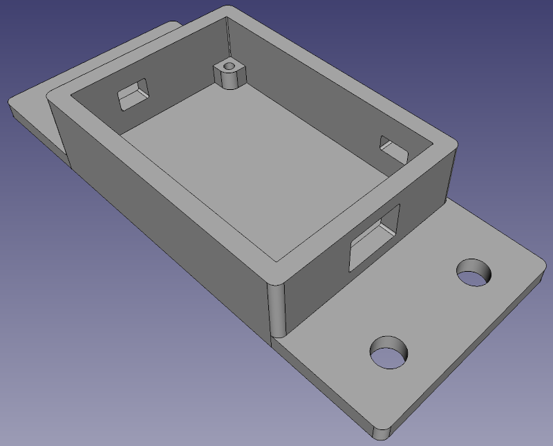

# servo2040_enclosure 
Enclosure for the Pimoroni 2040 18-channel servo controller designed in Freecad. 
Made to mount onto a t-slot extrusion using 1/4-20s.

# License: 
Creative Commons Attribution 4.0 International CC BY 4.0

